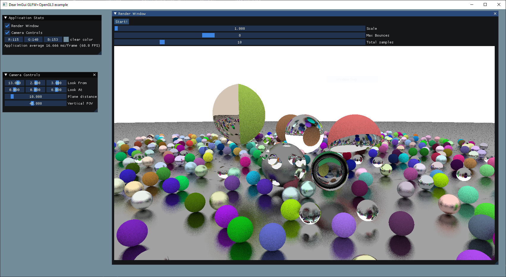

# Raytracing on CPU

## Instructions

1. Clone repository and submodules
   ```
   git clone --recurse-submodules https://github.com/FiendChain/RaytracingCPU.git
   ```
2. Open project folder with VSCode or Visual Studio and setup as CMake project

## Features
- Sphere geometry
- Lambertian, metallic and dielectric materials
- Intersecting and subtractive surface geometry
- Multithreaded tile rendering

## TODO
- Planar and cubic geometry
- More complex rendering techniques listed here:
  [CSG Operations of Arbitrary Primitives with Interval Arithmetic and Real-Time Ray Casting](https://drops.dagstuhl.de/opus/volltexte/2010/2698/pdf/7.pdf)
- Optimisation of renderer
- Better memory allocation

## Images

